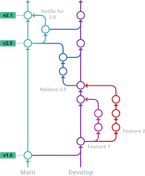

# support360.activetrac

---

# 🛠️ Sistema de Soporte360 [Activetrac] - Frontend (React)

Aplicación frontend desarrollada en **React** para la gestión de tickets de soporte técnico. Permite a los usuarios reportar incidencias, dar seguimiento y comunicarse con agentes de soporte.


---


## 🚀 Tecnologías Utilizadas

- [React](https://reactjs.org/)
- [React Router](https://reactrouter.com/) [TODO]
- [Axios](https://axios-http.com/) - cliente HTTP [TODO]
- [Tailwind CSS](https://tailwindcss.com/) - estilos [TODO]
- [Redux Toolkit](https://redux-toolkit.js.org/) (opcional) [TODO]


---


## 📦 Instalación [TODO]

1. Clona el repositorio:
   ```bash
   git clone https://github.com/mosh086/support360.activetrac.git
Accede a la carpeta del proyecto:

bash
Copiar
Editar
cd sistema-soporte-frontend [TODO]
Instala las dependencias:

bash
Copiar
Editar
npm install
Crea un archivo .env con las siguientes variables (según tus entornos):

ini
Copiar
Editar

Ejecuta el servidor de desarrollo:
bash
Copiar
Editar
npm run dev

---


🔧 Scripts Disponibles
Comando	Descripción
npm run dev	Ejecuta app en modo desarrollo
npm run build	Compila la app para producción
npm run preview	Vista previa post-build
npm run lint	Linter del código (ESLint)

---


🧩 Estructura del Proyecto [TODO]
bash
Copiar
Editar
📦 sistema-soporte-frontend
├── public/
├── src/
│   ├── assets/
│   ├── components/
│   ├── pages/
│   ├── services/       # Axios & API handlers
│   ├── store/          # Redux o context
│   ├── utils/
│   └── App.jsx
├── .env
└── README.md


---


🔐 Autenticación [TODO]
La aplicación utiliza autenticación basada en tokens (JWT) y controla el acceso según el rol (usuario/agente/admin).


---


📌 Funcionalidades [TODO]
Registro e inicio de sesión
Creación y seguimiento de Servicios de Mantenimiento


---


🗂️ Branching Strategy
main es la rama de producción.
development es la rama de integración (desarrollo).
Se utilizan ramas feature, release, y hotfix.

📌 Objetivo
Establecer una estrategia clara de control de versiones utilizando Git, que permita un desarrollo colaborativo, organizado y seguro, minimizando errores en producción.

🌳 Ramas Principales
Rama	Propósito
main	Rama de producción. Solo contiene código estable.
development	Rama de integración. Contiene el último código aprobado para próxima versión.

🔄 Flujo General
Nuevas funcionalidades parten de development como base (feature/*).
Una vez validadas, se integran a development.
Cuando se quiere preparar una versión para producción, se crea una rama release/*.
Una vez validada la release, se fusiona a main (producción) y a development (para mantener coherencia).
Si hay errores críticos en main, se corrigen mediante ramas hotfix/*.

🧪 Tipos de Ramas
feature/*
Propósito: Desarrollo de nuevas funcionalidades o cambios importantes.
Base: development
Destino (merge): development
Ejemplo: feature/login, feature/api-refactor
release/*
Propósito: Preparar una versión para producción.
Base: development
Destino (merge): main y luego development
Ejemplo: release/v1.2.0
hotfix/*
Propósito: Corregir errores críticos en producción.
Base: main
Destino (merge): main y luego development
Ejemplo: hotfix/fix-login-bug

🔃 Reglas de Merge
Los feature/* se integran mediante Pull Request (PR) a development.
Las release/* y hotfix/* se integran mediante PR a main y development.
Todo PR debe pasar revisiones de código y pruebas automatizadas antes del merge.


